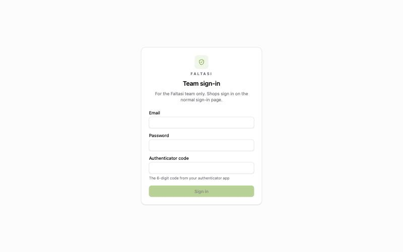
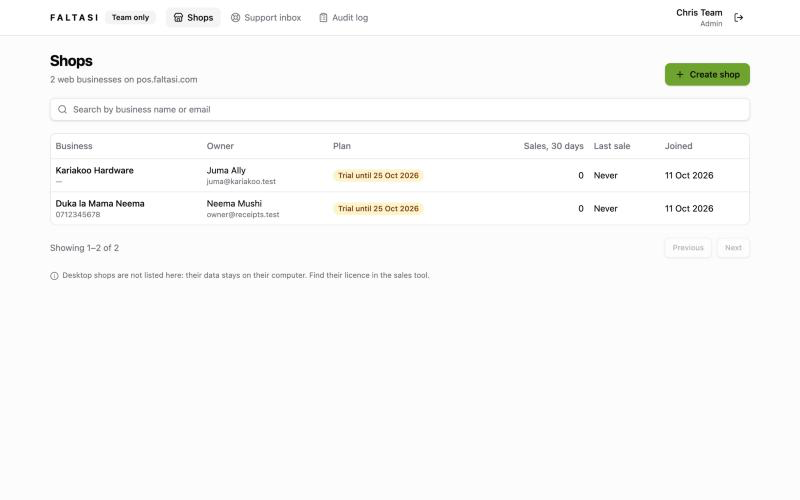
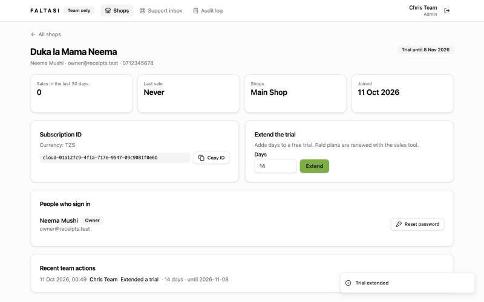
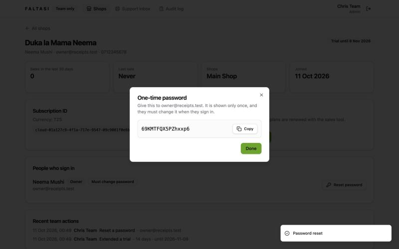
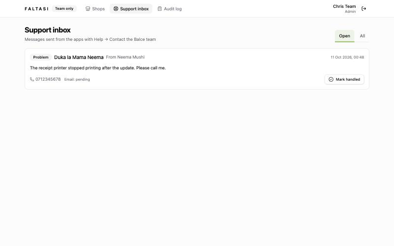
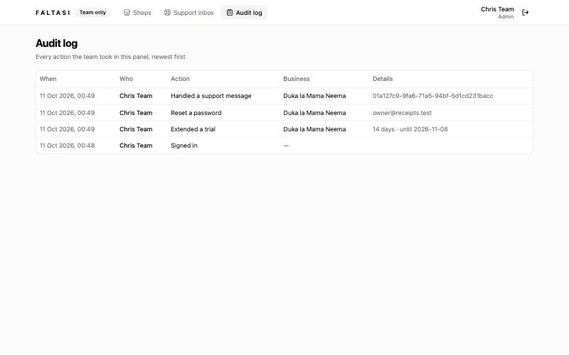

# Admin panel

**Added 11 Oct 2026, online only: pos.faltasi.com/admin.**

One web page for the Faltasi team to look after web shops. It is not for shops: they never see it, and their sign-in does not open it.

## Why it was added

Before, the team used three separate tools: the sales tool for subscriptions, a command on the server to create web shops, and direct server access for everything else. Support messages arrived only by email. Nobody could see at a glance which shops were active, which trials were ending, or who had done what.

## Who can sign in

Only team members created on the server. Each person has their own sign-in, made of three parts:

1. email;
2. password;
3. a 6-digit code from an authenticator app on their phone (Google Authenticator, Microsoft Authenticator, 1Password…).

The code changes every 30 seconds, so a stolen password alone is not enough. A sign-in lasts 8 hours. After 5 wrong tries the address waits 15 minutes.

| Role | Can do |
| :--- | :--- |
| **Support** | See shops, extend trials, reset passwords, handle support messages |
| **Admin** | All of that, plus create shops and read the audit log |

### Creating a team member (technical team)

On the server:

```bash
docker exec balce-api /balce-admin create-staff -email name@faltasi.com -name "Full Name" -role admin
```

It prints a **password**, an **authenticator key** and an **authenticator link**. Give them to the person privately. They add the key to their authenticator app (or open the link on their phone), then sign in at pos.faltasi.com/admin. Running the same command again for the same email gives them a new password and a new key, for example when a phone is lost.



## What it does

### Shops

Every web business, newest first, with search by business name or email. Each row shows the owner, the plan (trial, paid or ended, with the date), sales in the last 30 days, the last sale and when they joined.

Desktop shops are not listed: their data stays on their own computer. Their licences are still found in the sales tool.



**Create shop** (admins) makes a new web business and its owner. It shows a one-time password once; the owner must change it at their first sign-in. This replaces the server command `create-company` for everyday use.

### One shop

- the owner, phone, shops, sales, last sale and join date;
- the **Subscription ID** (`cloud-…`) with a copy button, for the sales tool;
- **Extend the trial** by 1 to 90 days. Paid plans are renewed with the sales tool, so this is refused for them;
- everyone who signs in, with their role, and **Reset password**. After a confirmation, the person is signed out everywhere and a one-time password is shown once;
- the last 20 team actions on this business.





### Support inbox

Messages sent from the apps with **Help → Contact the Balce team**, newest first: the business, who sent it, the topic, the message, the phone and email to reply to, and whether the email copy went out. **Mark handled** moves it out of **Open**; **All** shows handled ones with who handled them and when. The email copy still goes to the support mailbox as before.



### Audit log (admins)

Every sign-in and every action in the panel: who, what, which business, and details. It cannot be edited from the panel.



## What it does not do yet, and why

| Not yet | Why | Until then |
| :--- | :--- | :--- |
| Activate or renew a paid plan | Plans and payments live in Wapangaji; the panel would need its own partner access there | Use the sales tool with the Subscription ID |
| Remove old computers at the device limit | Same: devices are counted in Wapangaji | Sales tool / Wapangaji |
| Suspend a shop, announcements, health charts | Not asked for in the first version | Ask when needed |
| Team members change their own password | Passwords are random and long; the server command replaces them | Run `create-staff` again |

## Behind the scenes

- Shops are separated in the database by row-level security. The panel turns on a read-only "team view" for its own requests; any change (trial, password, support) is made inside that one shop's space, exactly like the shop's own requests.
- The team sign-in is a separate cookie that only the `/api/admin` addresses accept. A shop owner's sign-in is refused there, and a team sign-in does nothing in the shop app.
- The desktop app has no admin panel.

## For developers

- Backend: `backend/internal/admin` (`service.go`, `repository.go`, `handler.go`, `totp.go`); routes in `registerAdminRoutes` in `backend/internal/server/routes.go` (Postgres only).
- Migration 000060: `platform_staff`, `platform_sessions`, `platform_audit`, `support_messages.handled_at/handled_by`, and `platform_admin_read` policies on companies, users, roles, shops, sales, company_subscriptions, support_messages.
- CLI: `create-staff` in `backend/cmd/admin/staff.go`.
- Test: `TestTheAdminPanelSeesEveryShopOnlyForSignedInTeamMembers` (Postgres, as a role that cannot bypass row-level security).
- Frontend: `frontend/app/pages/admin/*`, `layouts/admin.vue`, `middleware/admin.ts`, `composables/useAdmin.ts`, `components/admin/OneTimePasswordDialog.vue`, `locales/*/admin.json`.
- PRs: balceinv-api #82, balceinv #60. Details: `steps.md`, Phase 37.
