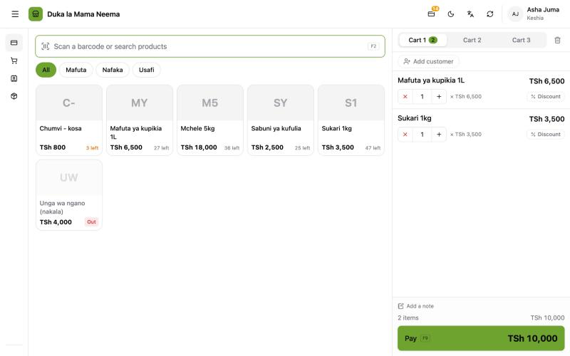
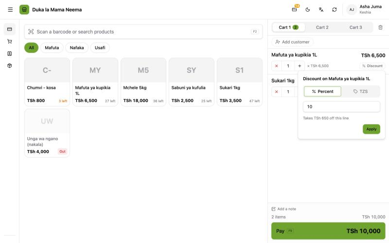
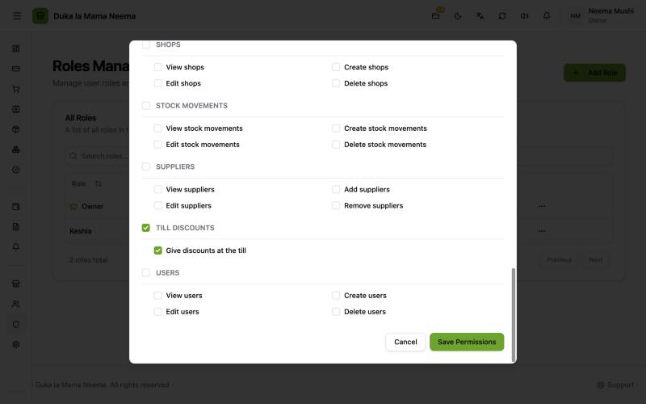

# Cashier discounts at the till

A cashier can take money off one cart line on the spot: a percent or an amount. Only staff the owner allows can do it, and every cashier discount is printed on the receipt.

**Timeline**

| Date | Version | What happened |
| :--- | :--- | :--- |
| 29 Sep 2026 | v2.0.0 (released 30 Sep) | The till was rebuilt and the old "% off" box was left out on purpose. |
| 6 Oct 2026 | v2.0.4 | It came back as **Discount (Punguzo)** on each line, behind a permission, with an owner limit. |
| 6 Oct 2026 (merged), released 7 Oct | v2.0.5 | The limit was removed at the owner's request. |

For the support answer, see the team guide [Discounts at the till](../team/till-discounts.md).

## Why it was removed on 29 Sep

- The old till had a "% off" box on each line that **any** cashier could use.
- It only worked because the server trusted the prices the screen sent. So any cashier could sell anything at any price, and nothing recorded that a discount was given or by whom.
- On 29 Sep the till was rebuilt. The server now works out every price, discount and tax itself and ignores prices sent by the screen. The "% off" box could not work that way, so it was left out. The plan (`steps.md`, Phase 5) listed it as "left out on purpose, add when asked: needs its own permission and audit".
- The owner was not told at the time. Testers reported "there is no discount at the till".

## Why it came back

The owner asked for it. It came back in v2.0.4, built the safe way:

- its own permission, so the owner chooses who may give discounts;
- the server checks the permission and works out the amount itself;
- each discount is saved on the sale line and printed on the receipt.

## The limit: added in v2.0.4, removed in v2.0.5

- **v2.0.4** added an owner setting in **Settings → Hardware (Vifaa)**: **Most a cashier may take off (Kiwango cha juu cha punguzo la keshia)**, per cart line. It started at 100%. Above the limit the till blocked the discount, and the server refused it. The owner had no limit.
- **v2.0.5** removed it. The owner's rule: **if you are allowed to give a discount, you can give up to 100%.** Who may give discounts is controlled only through Roles.
- The setting, the check and its error message are gone. The column was dropped from the database.

## How to give a cashier discount

1. Add the product to the cart.
2. On that line, press **Discount (Punguzo)**.
3. Choose **Percent (Asilimia)** or the currency (for example TZS).
4. Type the number. The box shows **Takes {amount} off this line (Inapunguza {amount} kwenye bidhaa hii)**.
5. Press **Apply (Weka)**.

The line now shows the discount in green, for example **−10%**. To change it, press it again. To take it off, press it and choose **Remove (Ondoa)**.

## Who can give one

- The **owner** always can.
- Other staff need the permission **Give discounts at the till (Kutoa punguzo kaunta)**, under **Till discounts (Punguzo la kaunta)**.
- No role has it at first. The owner ticks it in **Roles (Majukumu)** → the role → **Manage permissions (Simamia ruhusa)**.
- Staff without it do not see the **Discount** button.

## Rules

| Rule | Detail |
| :--- | :--- |
| One line at a time | A cashier discount belongs to one cart line, not to the whole sale. |
| Percent or amount | Percent: from 0.01% up to 100%. Amount: any amount. |
| Works out from the full line | The percent is taken from the line's full price (quantity × price, add-ons included). |
| Stacks on planned discounts | A planned discount from the **Discounts (Punguzo)** page applies first. The cashier discount comes on top. |
| Never below zero | If the two together are more than the line, the line stops at 0. |
| Works on wholesale lines | Planned discounts skip wholesale-priced lines; a cashier discount does not. |
| No limit | Since v2.0.5. 100% is allowed: the line becomes free. |

## Behind the scenes

- **The server decides the price.** The till sends only "percent 10" or "amount 500". The server works out the money, checks the permission, and refuses a discount from someone without it.
- **Receipts** (printed, PDF and the receipt page) show **Cashier discount (Punguzo la keshia)** on its own row, separate from planned discounts, with the cashier's name on the receipt.
- **Sales history** shows **Cashier discount −{amount} (Punguzo la keshia −{amount})** on the line.
- **Totals and books:** the cashier discount is part of the sale's discount total. The books record the sale at the price actually charged.
- The **Sales History (Historia ya Mauzo)** card **Discounts given (Punguzo lililotolewa)** includes cashier discounts.

## For developers

- Pricing: `backend/internal/sales/pricing.go` (`priceLine`, `manualDiscountAmount`). Percent is in basis points, capped at 10000; the discount is capped at what is left of the line after the automatic discount.
- Permission check: `checkManualDiscounts` in `backend/internal/sales/service.go`; permission `till_discounts:create` (`TillDiscountPermission`). Error: 403 `till_discount_not_allowed`.
- Request: each line in `POST /api/sales` and `POST /api/sales/quote` may carry `manual_discount: { kind: "percent" | "amount", value }`.
- Storage: `sale_items.manual_discount_amount` (migration 000055). Migration 000056 dropped `settings.till_discount_limit_basis_points`.
- Removed in v2.0.5: the `till_discount_over_limit` error (422), the limit in till options and the Settings field.
- Screen: `frontend/app/components/pos/LineDiscountPopover.vue`.
- PRs: balceinv-api #72, #73; balceinv #46, #47. Details: `steps.md`, Phases 5, 30 and 31.
