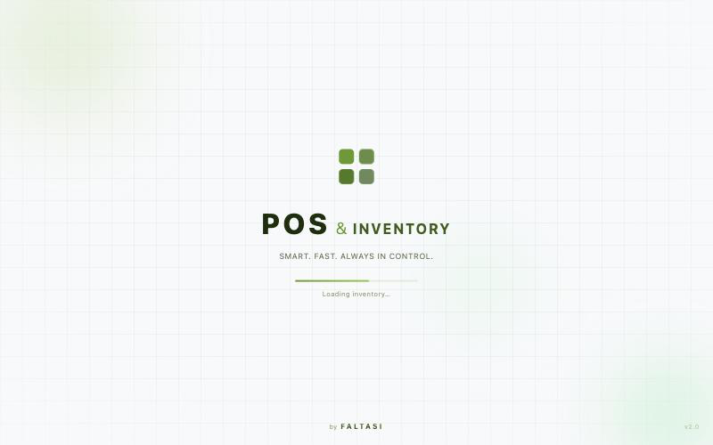
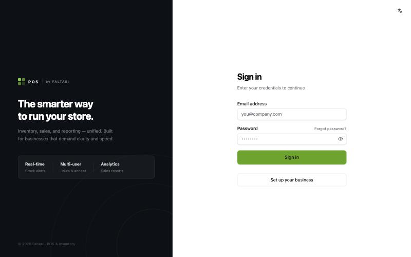
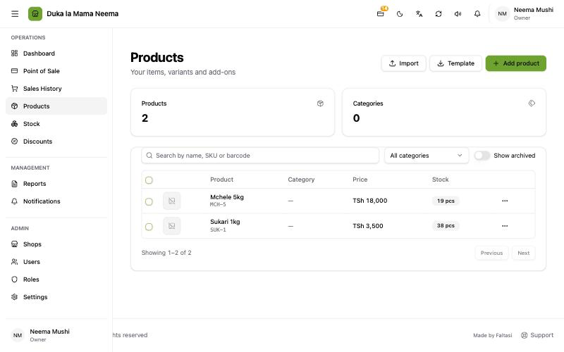
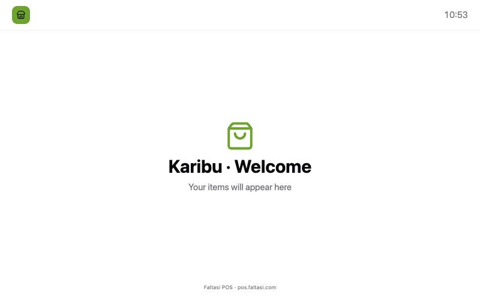
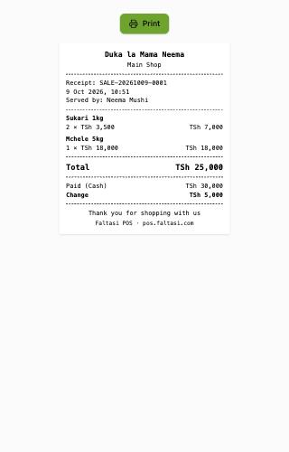
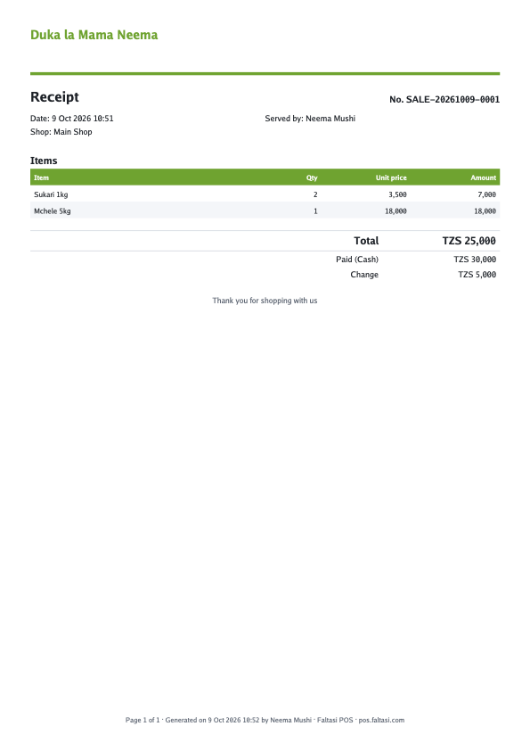

# Faltasi branding

**Added in v2.0.7 (9 Oct 2026).**

Balce now says who makes it. Faltasi appears in a few chosen places, small and in the same style as the screen around it, so shops and their customers know the vendor without the app looking like an advert.

## Why it was added

Before v2.0.7, nothing in the app named Faltasi. The start screen said only **POS & INVENTORY**, the sign-in screen said **© POS & Inventory**, and receipts ended with the shop's thank-you line. A customer who liked the till at a shop had no way to find out what it was or where to get it.

## Where it shows, and why there

| Place | What it says | Why there |
| :--- | :--- | :--- |
| Start screen | **by FALTASI** (Kiswahili: **kutoka FALTASI**) at the bottom, centred | Where app makers sign their splash screen. Seen every time the app opens. |
| Sign-in and setup | **POS \| by FALTASI** beside the logo; **© 2026 Faltasi · POS & Inventory** at the foot | The first screen a new owner or cashier reads. |
| Footer of every page | **Made by Faltasi (Imetengenezwa na Faltasi)** beside **Support (Msaada)** | Support comes from Faltasi, so the two sit together. |
| Settings → Updates (desktop only) | **Balce Inventory · Made by Faltasi** under the version | Where people look for "what is this app and which version". |
| Customer display, while waiting | **Faltasi POS · pos.faltasi.com** at the foot of the screen | The shop's customers look at this screen. |
| Receipt on screen and printed | **Faltasi POS · pos.faltasi.com** (printed: `Faltasi POS - pos.faltasi.com`) as the last line, under the shop's own thank-you | Every customer takes one home. It is the place most likely to bring new shops. |
| Every PDF (receipt, reports, statements) | Page footer: **… · Faltasi POS · pos.faltasi.com** | Documents travel: shops send them to accountants, suppliers and customers. |
| Excel files | Page footer **… · Faltasi POS**; file author "Faltasi POS" | Same reason, for printed spreadsheets. |
| Windows and Mac install | Publisher **Faltasi**, copyright **© 2026 Faltasi** | Shown in Windows **Apps** / **Programs and Features** and the Mac **About** box, where people check who made a program. |

The shop's own name, logo and receipt footer are unchanged and still come first. Faltasi is always the last, smallest line.

## What was not done, and why

- **No switch to turn it off.** The line is one small row under the shop's text. Add an owner setting if paying shops ask for unbranded receipts.
- **No Faltasi logo image.** No final logo file was in the project; text works on every printer and screen. Swap in the logo when one is ready.
- **The window title and app name stay "POS" and "Balce Inventory".** Changing the app name would change the install folder and break updates for existing desktops.

## For developers

- Words: `misc.brand.by` and `misc.brand.madeBy` in `frontend/app/locales/{en,sw}/misc.json`. "Faltasi POS · pos.faltasi.com" is not translated.
- Screens: `frontend/app/pages/index.vue` (`.vendor`), `login.vue` and `setup.vue` (`.wordmark-vendor`, `.panel-foot`), `components/AppFooter.vue`, `pages/settings/index.vue` (Updates card), `pages/display/index.vue` (idle footer), `pages/receipts/[id].vue`.
- Printed receipt: `vendorLine` in `backend/internal/printing/receipt.go`, after the print time.
- Documents: `pdfFooter` and `excelFooter` in `backend/internal/documents/labels.go`; creator in `pdf.go` and `excel.go`.
- Installer: `bundle.publisher` and `bundle.copyright` in `src-tauri/tauri.conf.json`.
- PRs: balceinv #53, balceinv-api #79. Details: `steps.md`, Phase 35.
