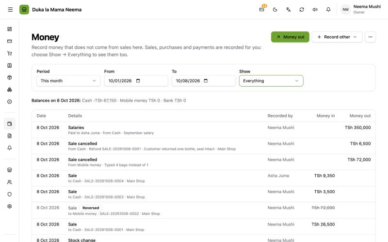
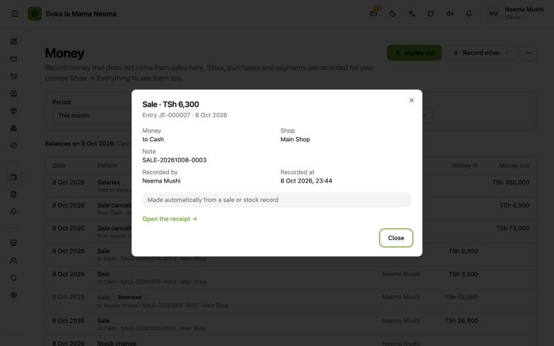
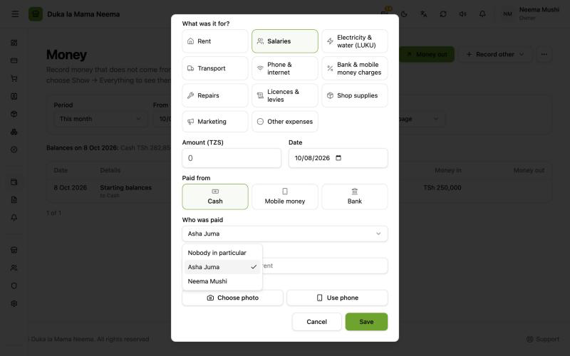

# Money and the books

**Show → Everything, party names, links and Paid to added in v2.0.5 (7 Oct 2026).**

The books (Simple books or Full accounting) are switched on in **Settings (Mipangilio)** → **Features (Vipengele)**. Then **Money (Fedha)** appears in the menu. How to switch them on, start them and record an expense is in the team guide [Recording expenses](../team/recording-expenses.md).

## What goes into the books by itself

Balce writes these into the books automatically. **Never type them again in Money**: they would count twice.

| Done in | Shows on the Money page as |
| :--- | :--- |
| A sale at the till | **Sale (Mauzo)** |
| [Void sale](void-sale.md) and [refunds](refunds.md) | **Sale cancelled (Mauzo yaliyoghairiwa)** |
| Changing stock with a reason (including opening stock) | **Stock change (Marekebisho ya stoku)** |
| Sending stock between shops | **Stock sent between shops (Uhamisho wa stoku)** |
| Stock arrived from a supplier, and cancelling it | **Stock bought (Stoku iliyonunuliwa)**, **Purchase cancelled (Ununuzi ulioghairiwa)** |
| Paying a supplier, and cancelling the payment | **Paid a supplier (Malipo kwa msambazaji)**, **Supplier payment cancelled (Malipo kwa msambazaji yaliyoghairiwa)** |
| Returning goods to a supplier | **Returned to a supplier (Bidhaa zilizorudishwa kwa msambazaji)** |
| A customer paying their debt, and cancelling it | **Customer paid (Malipo ya mteja)**, **Customer payment cancelled (Malipo ya mteja yaliyoghairiwa)** |
| Order deposits and their refunds | **Order deposit (Malipo ya awali ya oda)**, **Order deposit refunded (Malipo ya awali yaliyorudishwa)** |

## What to type in Money

Only money that does not come from the above:

| Button | For |
| :--- | :--- |
| **Money out (Pesa iliyotoka)** | Rent, salaries, LUKU, transport and other expenses |
| **Record other (Rekodi nyingine)** → **Other money in (Pesa nyingine iliyoingia)** | Money in that is not from selling |
| **Record other** → **Move money (Hamisha pesa)** | Cash to the bank, mobile money to cash… |
| **Record other** → **Owner put in (Mmiliki ameweka pesa)** / **Owner took out (Mmiliki amechukua pesa)** | The owner's own money in or out |

> **Never type stock you bought, or a payment to a supplier, in Money out.** Record them under **Suppliers (Wasambazaji)**. They reach the books by themselves.

## Seeing everything on the Money page

### Why it was added

In Simple books, the Money page table listed **only what was typed on the Money page**. But the balances above the table (cash, mobile money, bank) included sales, purchases and payments too. Testers saw balances move without a matching row and reported "money isn't linked to sales and purchases".

The money was always linked. The table just did not show the automatic records.

### How to use it

1. Open **Money (Fedha)**.
2. Set **Show (Onyesha)** to **Everything (Kila kitu)**.

The table now lists automatic records next to the typed ones. The default, **Typed on this page (Zilizoandikwa hapa)**, still shows only what was typed. This works in both Simple books and Full accounting.

Each row shows, where it applies:

- the **customer or supplier** name;
- **Paid to {name} (Amelipwa {name})** for money paid to a staff member;
- the shop, the money place (cash, mobile, bank) and the note.

### Opening a record

Click a row. The details show the customer or supplier, who was paid, the account lines, who recorded it and when. Automatic records say **Made automatically from a sale or stock record (Imetengenezwa yenyewe kutokana na mauzo au rekodi ya stoku)** and have a link:

| Record | Link |
| :--- | :--- |
| Sale, voided sale or refund | **Open the receipt (Fungua risiti)**, which opens the sale |
| With a customer | **Open the customer (Fungua mteja)** |
| With a supplier | **Open the supplier (Fungua msambazaji)** |

Typed records can be undone with **Reverse (Batilisha)** and a reason. Automatic records are fixed where they were made (void the sale, cancel the payment), not on the Money page.

## Paid to, for salaries

### Why it was added

A salary record could not say who was paid. The only option was to write the name in the note, so nothing could be listed or checked by person.

### How to use it

1. **Money (Fedha)** → **Money out (Pesa iliyotoka)**.
2. Under **What was it for? (Ilikuwa ya nini?)** choose **Salaries (Mishahara)**.
3. Under **Who was paid (Nani amelipwa)** choose the staff member. For Salaries this is required: without it the screen says **Choose who was paid (Chagua nani amelipwa)**.
4. Fill in the amount and **Paid from (Imelipwa kutoka)**, then save.

For other expenses the field is **Paid to (optional) (Amelipwa (si lazima))**, with **Nobody in particular (Hakuna mtu maalum)** as the default.

The list shows the business's active Balce users. The record then shows **Paid to {name} (Amelipwa {name})**.

There is no payroll (payslips, deductions, tax). Paid to only records who received the money.

## For developers

- Entries list: `GET /api/accounting/entries`; without `source_type`, every source is returned. The "Typed on this page" view sends `moneyPageSources` from `frontend/app/composables/useMoney.ts`.
- Entries now carry `party_type`, `party_id`, `party_name` and `paid_to_name` (`backend/internal/accounting/party_repository.go`, `report_repository.go`).
- Paid to: `journal_entries.paid_to_user_id` (migration 000058). Money out accepts `paid_to_user_id`; the server checks it is a user of the business (`paidTo` in `backend/internal/accounting/service.go`). "Required for Salaries" is enforced by the screen (`MoneyActionDialog.vue`) and, since 9 Oct, by the server too: a salary without `paid_to_user_id` gets 400 `paid_to_required` (`checkSalaryNamesWhoWasPaid`).
- People list: `GET /api/accounting/people` (active users), needs `accounting:create` and the books on.
- Source links: `frontend/app/components/money/EntryDetailsDialog.vue` (`sourceLink`, using `source_sale_id` from the entry); the row text in `EntriesTable.vue`; the **Show** select in `frontend/app/pages/money/index.vue`.
- Automatic postings: `backend/internal/accounting/postings.go`.
- PRs: balceinv-api #74, balceinv #48. Details: `steps.md`, Phases 23 and 32.
