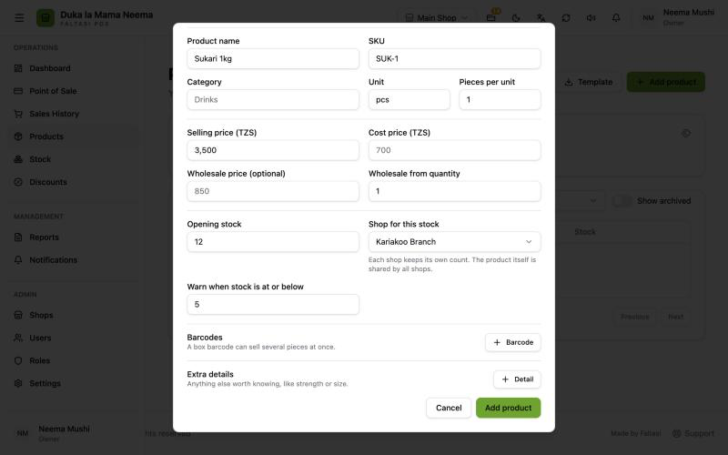
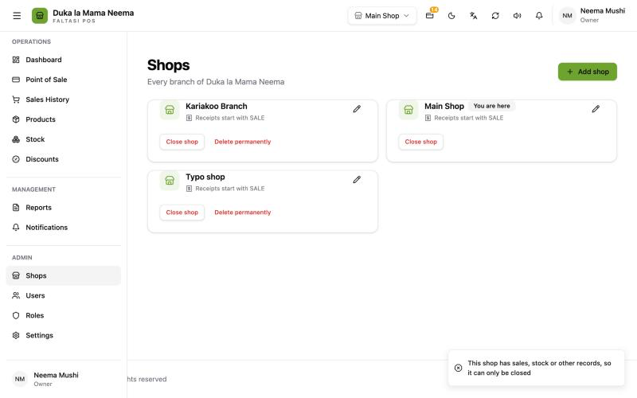
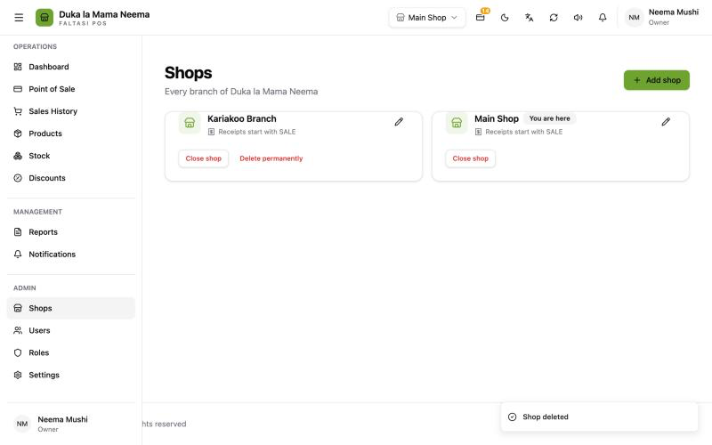
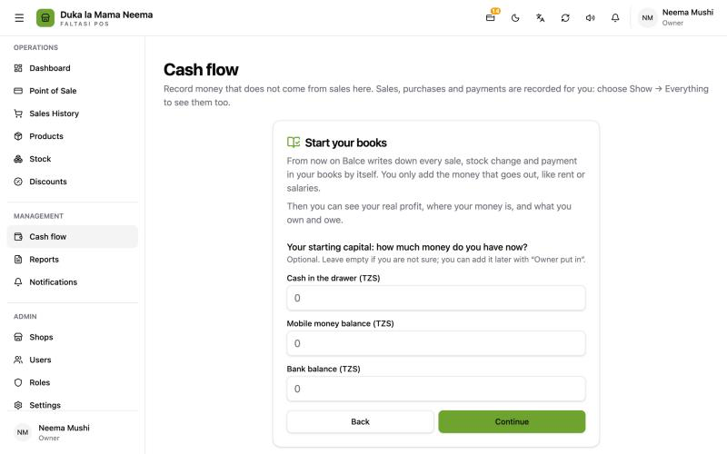

# Owner requests, v2.0.8

**Added in v2.0.8 (10 Oct 2026).**

Five requests from the owner after testing v2.0.7, and what was built for each. While testing these, three confirm buttons that did nothing were found and fixed.

## 1. Choose the shop for a new product's stock

**What the owner said:** "When adding a product I expected to choose the shop, so each shop's count is known."

**What was already there:** stock was already counted per shop, but the opening stock went silently into the shop picked in the top bar. The form never said which one.

**What changed:** **Products (Bidhaa)** → **Add product (Ongeza bidhaa)** now shows **Shop for this stock (Duka la stoku hii)** beside **Opening stock (Stoku ya kuanzia)** when the user works in more than one shop. It starts on the current shop. With one shop it just says **Goes into {shop} (Inaingia {shop})**.

The product itself stays shared by all shops: every shop sells the same "Sukari 1kg". Only the count belongs to each shop. Staff can only put stock into a shop they work in.

## 2. Delete a shop made by mistake

**What the owner said:** "I added a shop by mistake and want to remove it. There is no delete button."

**What was already there:** **Close shop (Funga duka)**, which hides a shop and keeps its history. It turned out to be broken: pressing the button in the dialog sent nothing (see "Buttons that did nothing" below).

**What changed:** **Shops (Maduka)** now has **Delete permanently (Futa kabisa)** on every shop except the one you are working in. It only works for a shop that was never used:

| Refused when | Message |
| :--- | :--- |
| The shop has sales, stock, transfers, purchases, orders, payments or book entries | "This shop has sales, stock or other records, so it can only be closed" |
| Some staff work only in that shop | "Give them another shop on the Users page first" |
| It is the shop you are working in | "Switch to another shop before deleting this one" |
| It is the last open shop | "You can't close the last open shop" |

A used shop can only be closed, because past receipts and reports name it.

## 3. Starting capital when the books are switched on

**What the owner said:** "When someone logs in for the first time, take them to fill in capital."

**Why it was not done on first login:** cashiers also log in for the first time, shops with the books off have nowhere to put capital, and the welcome tour already runs then. The owner chose to do it when the books are switched on instead.

**What changed:** in **Settings (Mipangilio)** → **Features (Vipengele)**, saving with **Simple books** or **Full accounting** turned on (from off) goes straight to **Cash flow (Mzunguko wa fedha)**, where **Start your books (Anzisha vitabu vya hesabu)** opens. Its money step now says **Your starting capital: how much money do you have now? (Mtaji wa kuanzia: una pesa kiasi gani sasa?)**, with cash in the drawer, mobile money and bank.

## 4. Money is now Cash flow

The menu item, the page title, the tour and the error messages now say **Cash flow (Mzunguko wa fedha)** instead of **Money (Fedha)**. Nothing on the page changed. The buttons **Money out (Pesa iliyotoka)** and **Record other (Rekodi nyingine)** keep their names. See [Cash flow and the books](money-and-books.md).

## 5. Faltasi in the top bar and the browser tab

On top of the [v2.0.7 branding](faltasi-branding.md):

- **Top bar:** a small **FALTASI POS** line under the business name.
- **Browser tab:** every page reads "{page} · Faltasi POS", for example "Products · Faltasi POS". Sign-in reads "Faltasi POS".
- **Desktop window title:** "Faltasi POS" instead of "POS".

## Buttons that did nothing (fixed)

Three confirm dialogs dropped what they were about to act on the moment they closed, before the confirm ran, so nothing was sent and nothing happened:

- **Close shop (Funga duka)**;
- **Stop discount (Sitisha punguzo)**;
- **Remove (Ondoa)** on a customer.

All three now keep the shop, discount or customer until the action is done. Each was checked in a local preview.

## For developers

- Opening stock shop: `shop_id` on `POST /api/products`; `stockShop` and `CanStockShop` in `backend/internal/products`. Test `TestOpeningStockGoesToTheChosenShop`. Screen: `ProductFormDialog.vue`.
- Shop delete: `POST /api/shops/:id/delete`; `DeletePermanently` in `backend/internal/shops/service.go`, `delete_repository.go`. Test `TestOnlyUnusedShopsCanBeDeletedPermanently`. Screen: `frontend/app/pages/shops/index.vue`.
- Books on → capital: `save` in `frontend/app/components/settings/FeaturesPanel.vue`.
- Cash flow: `nav.items.money`, `money.page.title`, `tour.money.intro.title`, `errors.books_not_started`, `errors.not_reversible`.
- Top bar and tabs: `AppHeader.vue`; `titleTemplate` in `frontend/app/plugins/01.brand.client.ts`; page titles in `frontend/app/layouts/default.vue`; window title in `src-tauri/tauri.conf.json`.
- Dialogs: `pages/shops/index.vue`, `pages/discounts/index.vue`, `components/customers/CustomerStatusDialog.vue`.
- PRs: balceinv-api #80, #81; balceinv #54 to #59. Details: `steps.md`, Phase 36.
