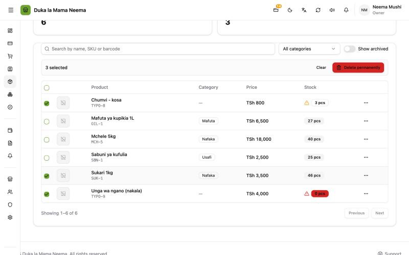
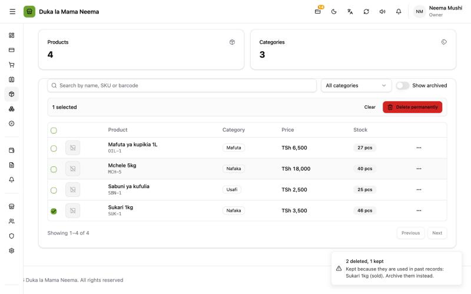

# Deleting products

**Permanent and bulk delete added in v2.0.6 (8 Oct 2026).**

There are two ways to remove a product:

| | **Delete permanently (Futa kabisa)** | **Archive (Weka kando)** |
| :--- | :--- | :--- |
| For | Products made by mistake, never used | Products the shop stopped selling |
| What happens | Gone for good, with its variants, barcodes and stock | Hidden from the till and the product list; old records keep it |
| Can it come back? | No | Yes: **Show archived (Onyesha zilizowekwa kando)** → **Restore (Rejesha)** |
| Works on used products? | No, they are skipped | Yes |

## Why it was added

Before v2.0.6 a product could only be archived. A product made by mistake (a typo, a duplicate, a test product) stayed in the database forever. Testers asked to "delete a product completely".

## How to delete

### One product

1. Open **Products (Bidhaa)**.
2. Open the **…** menu on the product's row.
3. Choose **Delete permanently (Futa kabisa)**.
4. Read the message and press **Delete permanently (Futa kabisa)** again to confirm.

### Many products at once

1. Open **Products (Bidhaa)**.
2. Tick the box on each product to delete. Ticks stay when you go to the next page, so you can pick products from several pages. The box in the header ticks **every product on this page**.
3. A bar appears: **{count} selected ({count} zimechaguliwa)**.
4. Press **Delete permanently (Futa kabisa)** in the bar. Every ticked product is sent, from every page.
5. Confirm with **Delete permanently (Futa kabisa)**.

**Clear (Ondoa uchaguzi)** in the bar unticks everything.

### The result

- All deleted: **{count} deleted ({count} zimefutwa)**.
- Some kept: **{deleted} deleted, {skipped} kept ({deleted} zimefutwa, {skipped} zimebaki)**, with the names of the kept products and why. For example: "Kept because they are used in past records: Sugar (sold). Archive them instead."

## Which products are kept, and why

A product is kept (skipped) if it, **or any of its variants**, appears in any past record:

| Shown reason | English (Kiswahili) | Where it was used |
| :--- | :--- | :--- |
| sold | sold (imeuzwa) | Any sale, **including voided and refunded sales** |
| bought | bought from a supplier (imenunuliwa kwa msambazaji) | A purchase (stock arrived) or a purchase order |
| returned_to_supplier | returned to a supplier (imerudishwa kwa msambazaji) | A supplier return |
| ordered | ordered by a customer (imeagizwa na mteja) | A customer order |
| transferred | sent between shops (imehamishwa kati ya maduka) | A stock transfer |

Those records name the product and must keep working: receipts, reports, supplier statements, the books. So these products can only be **archived**.

## What a permanent delete removes

- the product and all its variants, with their barcodes;
- its stock in every shop, and its stock history;
- planned discounts made only for that product;
- alerts about it (for example low stock).

**The books:** if the books are on and the product had opening stock or stock changes, those stock entries are reversed first (reason "product deleted"), so the shop's stock value goes down by what the product was worth.

## Who can delete

The permission **Delete products (Futa bidhaa)**. The owner has it. It covers both **Archive** and **Delete permanently**. Without it, the tick boxes and both menu items are hidden. Bringing an archived product back (**Restore (Rejesha)**) needs permission to edit products.

## Naming history

The same menu item changed name twice:

| Version | Label | Why |
| :--- | :--- | :--- |
| up to v2.0.2 | **Archive (Weka kando)** | Hides the product; past sales keep it. |
| v2.0.3 (2 Oct) | **Delete (Futa)** | Testers said "there is no way to delete a product". It was there, as Archive, but they did not find it. The action did not change: it still only hid the product. |
| v2.0.6 (8 Oct) | **Archive (Weka kando)** again | A real permanent delete now exists. Calling the hide action "Delete" would have been confusing next to **Delete permanently**. |

## For developers

- Endpoint: `POST /api/products/delete`, body `{ "product_ids": [...] }` (1–500 ids), permission `products:delete`. Returns `{ deleted: [ids incl. variants], skipped: [{ id, name, reason }] }`.
- Archive is still `DELETE /api/products/:id` (sets `is_active = false`), same permission.
- Service: `DeletePermanently` in `backend/internal/products/service.go`; usage check and delete in `backend/internal/products/delete_repository.go` (`productUsage` lists the tables: `sale_items`, `purchase_lines`, `purchase_order_lines`, `supplier_return_lines`, `customer_order_lines`, `stock_transfer_items`).
- Books and stock: `stock.Service.RemoveProductStock` reverses each `stock_adjustment` entry for the product (source type `reversal`, reason "product deleted"), then deletes its stock rows. `DeleteFamily` removes `notifications` and `discounts` for the product, then the products.
- Each product is checked and deleted on its own, so one used product never blocks the others.
- Screen: `frontend/app/pages/products/index.vue`, row menu in `frontend/app/components/products/columns.ts`.
- PRs: balceinv-api #75, balceinv #49 (delete); balceinv #45 (the v2.0.3 rename). Details: `steps.md`, Phases 29 and 33.
