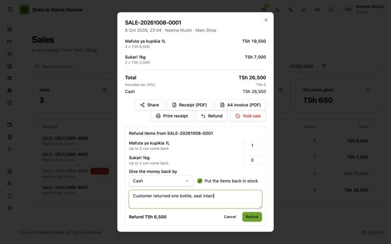
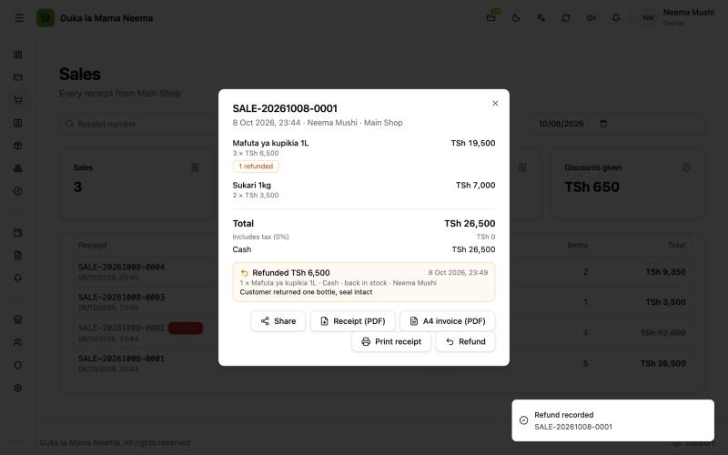

# Refunds

**Added in v2.0.6 (8 Oct 2026).**

A refund gives back some or all items of a sale: choose how many of each, how the money goes back, whether the items go back on the shelf, and why. A sale can have several refunds, until everything on it has come back.

## Why it was added

After v2.0.5, the only way to fix a sale was to [void](void-sale.md) the whole thing. That is right for a mistake made at the till, but not for:

- a customer who brings back one item out of three, days later;
- a broken item that cannot be sold again;
- a credit customer who returns goods and should owe less.

## Void or refund?

| | **Void sale (Batilisha mauzo)** | **Refund (Rudisha pesa)** |
| :--- | :--- | :--- |
| Use it when | The sale itself was a mistake (wrong item, wrong quantity) | The sale was right, but goods come back later |
| How much | The whole sale, once | Any quantity per line, many times |
| Stock | Always comes back | Comes back only if you tick it (untick for damaged goods) |
| Books | The sale's entry is undone in full, as if it never happened | A new entry on the refund day: money out, sales and VAT down, cost back if restocked |
| The sale in totals and reports | Left out completely | Stays in; the refund is counted on its own day |
| EFD | Credit note for the whole receipt | Refund note for the refunded items only |
| Permission | **Void sales (Kubatilisha mauzo)** | **Refund sales (Kurudisha pesa ya mauzo)** |

In accounting words: a void is a reversal of the original entry; a refund is a sales return.

## How to refund

1. Open **Sales History (Historia ya Mauzo)**.
2. Click the sale.
3. Press **Refund (Rudisha pesa)**. A panel **Refund items from {number} (Rudisha bidhaa za {number})** opens.
4. For each item coming back, type how many. Each line shows **Up to {count} can come back (Hadi {count} zinaweza kurudi)**.
5. Under **Give the money back by (Rudisha pesa kwa)**, choose:
   - **Cash (Taslimu)**, **Mobile money (Pesa ya simu)** or **Card (Kadi)**; or
   - **Take it off the customer's debt (Ipunguze kwenye deni la mteja)**. This choice only appears for a sale that was partly or fully **On credit (Mkopo)**, and is then picked first.
6. Leave **Put the items back in stock (Rudisha bidhaa kwenye stoku)** ticked if the items can be sold again. Untick it for broken or expired goods.
7. Write why. For example: **customer returned one, it was broken**. At least 3 letters.
8. Check the amount on **Refund {amount} (Rudisha {amount})**.
9. Press **Refund (Rudisha pesa)**.
10. Give the money back to the customer (unless it came off their debt).

The message **Refund recorded (Urejeshaji umerekodiwa)** appears. The sale now shows:

- **{count} refunded ({count} zimerudishwa)** on each refunded line;
- a box per refund: **Refunded {amount} (Imerudishwa {amount})**, the date, the items, the method, **back in stock (imerudi kwenye stoku)** or **not back in stock (haikurudi kwenye stoku)**, who did it, and the reason.

## Rules

| Rule | Detail |
| :--- | :--- |
| Not more than sold | Each line can give back at most what was sold, less what was already refunded. |
| Amount per item | The share of what the customer actually paid for that line, after discounts and with add-ons. |
| Last refund is exact | When a refund takes the last items of a line, it returns exactly what is left of that line, so rounding never leaves a few shillings behind. |
| Off the debt only for credit sales | **Take it off the customer's debt** only works on a sale with an **On credit** part, and only up to the amount this sale put on credit, less earlier refunds to the account. It is also never more than the customer owes right now: if they already paid the debt, give the money back in cash or mobile money instead. |
| Cash on a credit sale | Allowed. The money goes back in cash and the debt stays as it was. |
| Voided sales | Cannot be refunded. |
| Sales that completed a customer order | Can be refunded (they cannot be voided). The refund treats them like any other sale; the order itself stays completed. |
| Refunded sales | Cannot be voided. Refund the rest instead. |
| Everything back | When every item has come back, the **Refund** button disappears. |
| Pressing twice | Safe. A retry with the same refund is recognised and not recorded twice. |
| Reason | Required, 3 to 200 characters. |

## Behind the scenes

### Stock

If **Put the items back in stock** is ticked, each refunded quantity goes back to the shop that made the sale. If not, stock does not change: the item is treated as lost.

### The books

When the books are on, each refund posts one entry on the refund day:

| Line | Effect |
| :--- | :--- |
| Cash, mobile money or card payments | Down by the refund amount. For **Take it off the customer's debt**: what customers owe goes down instead. |
| Sales | Down by the refund amount without VAT. |
| VAT to pay | Down by the VAT in the refund (VAT-registered businesses only). |
| Stock value and cost of goods sold | Only if restocked: the items' cost goes back to stock value and comes off the cost of goods sold. |

The entry is linked to the customer, if the sale had one. On **Money (Fedha)** with **Show (Onyesha)** → **Everything (Kila kitu)**, a refund is listed as **Sale cancelled (Mauzo yaliyoghairiwa)**, the same label as a void, with "Refund {receipt number} · {reason}" as its note. Opening it shows **Open the receipt (Fungua risiti)**, which opens the sale that was refunded.

> **Books off?** Refunds recorded while the books are off are **not** added later when the books start. Start the books first if refunds should appear there.

### Customer debt

A refund **off the customer's debt** lowers what the customer owes by that amount. Other methods do not change the debt.

### Totals and reports

- **Sales History (Historia ya Mauzo):** the **Takings (Makusanyo)** card still shows the full takings of the sales in the list. Below it, **Refunds: {amount} (Zilizorudishwa: {amount})** shows what was refunded on those sales.
- **Reports, sales summary:** refunds are counted on the day they were made. Net sales = sales − VAT − (refunds − their VAT). The cost of restocked items comes off the cost of goods, so gross profit drops only by what was really lost. A non-restocked item keeps its cost, so it lowers profit.

### EFD (fiscal receipts)

For shops with EFD on, a refund on a sale that has an EFD receipt queues a **refund note**:

- it is sent only **after the original receipt has been accepted** by the EFD; until then it waits;
- it carries the original receipt number and verification code, the refunded items and amounts, the method and the reason, and says it is for a refund (`credit_for: "refund"`);
- it is sent like waiting receipts: by the open till every 5 minutes, or with **Send waiting to EFD (Tuma zinazosubiri kwa EFD)**;
- the refund box shows **EFD credit note: {status} (Hati ya kufuta ya EFD: {status})**.

Still to confirm with a real EFD provider: that it accepts the refund note.

## For developers

- Endpoint: `POST /api/sales/:id/refunds`, permission `sales:edit`. Body: `client_ref` (8–64), `method` (`cash` | `card` | `mobile` | `credit`), `restock`, `reason` (3–200), `lines: [{ item_id, quantity }]` (1–200 lines). Returns the sale with `refunds[]`, `refunded_total` and per-line `refunded_quantity`; 201 when new, 200 on a replay.
- Service: `backend/internal/sales/refund.go` (`Refund`, `refundLineAmount`, `checkCreditRefund`); SQL in `refund_repository.go`.
- Errors: 409 `refund_not_possible` (voided sale; also void on a refunded sale), 400 `refund_too_many` (unknown or repeated line, or above what is left), 400 `refund_credit_not_possible`, 409 `client_ref_reused`.
- Books: `Ledger.PostSaleRefund` in `backend/internal/accounting/postings.go`. Posted under source type `sale_void` with `source_id` = the refund id, because the SQLite source-type check cannot be changed safely. Entries carry `source_sale_id` (the sale for both voids and refunds), which the Money page uses for **Open the receipt**.
- Credit check: `checkCreditRefund` caps a refund to the account by what the sale put on credit (less earlier credit refunds) and by `customers.Service.Balance`.
- Debt: `customers/repository.go` subtracts `sale_refunds` with `method = 'credit'`.
- Totals: `refund_total` on `GET /api/sales/totals` (by sale filter); `refund_count` / `refund_total` and net sales in the reports summary (`reports/repository.go`, `reports/service.go`, by refund date).
- EFD: `fiscal_refund_notes`; claim waits until the original `fiscal_receipts` row is `sent`; payload `BuildRefundNotePayload` (`document_type: "credit_note"`, `credit_for: "refund"`), idempotency key `<refund id>:refund-note`.
- Migration 000059: `sale_refunds`, `sale_refund_lines`, `fiscal_refund_notes`.
- Screens: `frontend/app/components/sales/RefundPanel.vue`, `SaleDetailsDialog.vue`; Takings card in `frontend/app/pages/sales/index.vue`.
- PRs: balceinv-api #75, balceinv #49. Details: `steps.md`, Phase 33.
