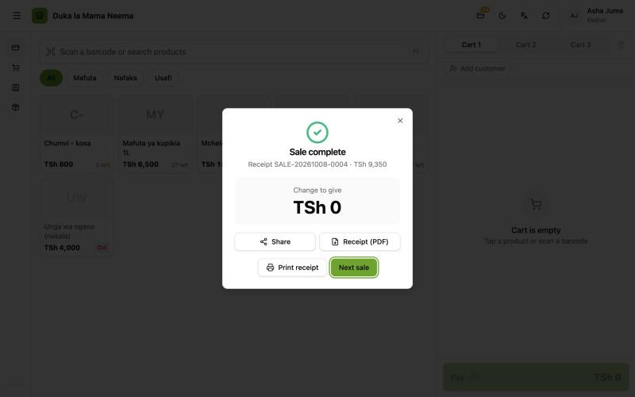
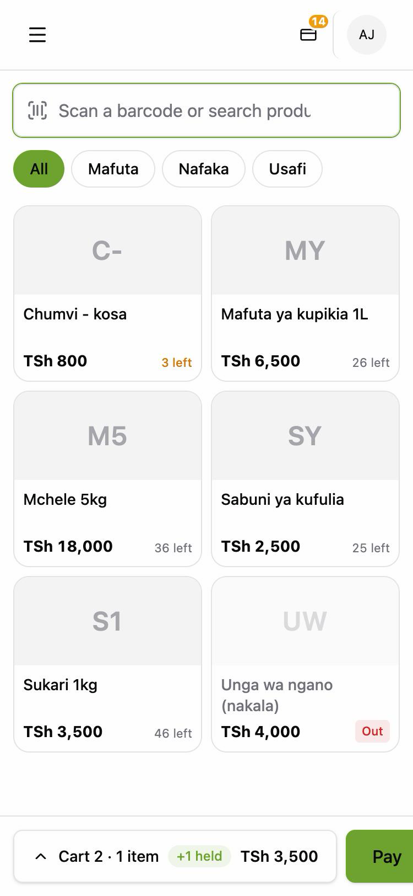
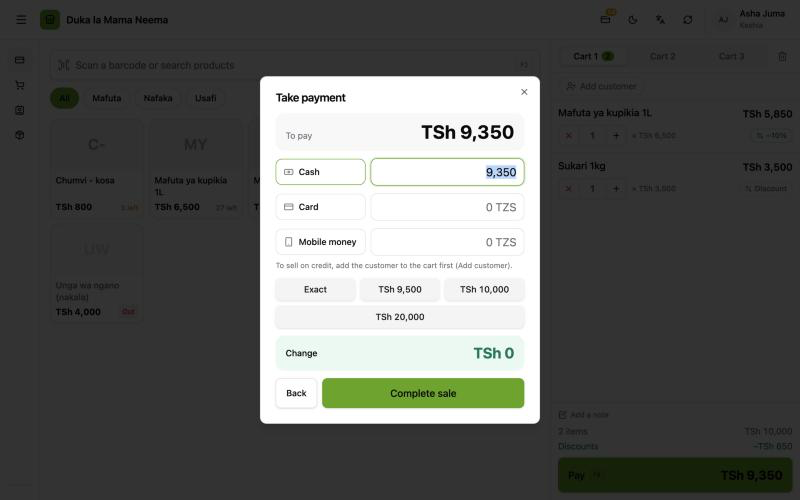
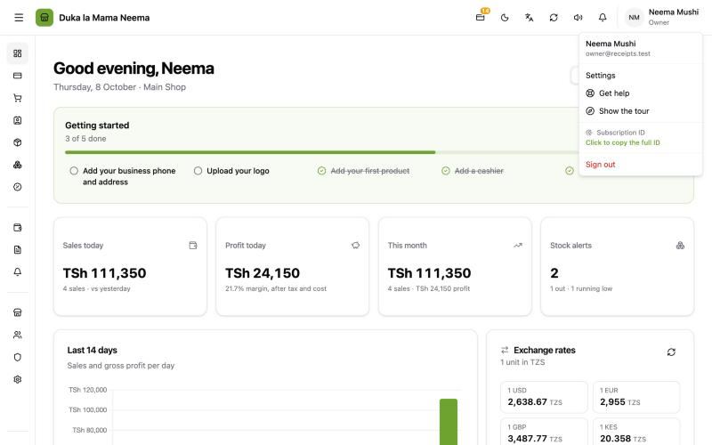

# Till and receipts

Smaller fixes at the till, on receipts and in the account menu, all from tester reports.

| Fix | Version |
| :--- | :--- |
| [Print on the desktop without a receipt printer](#print-on-the-desktop-without-a-receipt-printer) | v2.0.3 (2 Oct 2026) |
| [Receipt (PDF) and Share](#receipt-pdf-and-share) | v2.0.3 |
| [Held carts and the phone cart bar](#held-carts-and-the-phone-cart-bar) | phone bar in v2.0.5 (7 Oct 2026) |
| [Credit is called Mkopo](#credit-is-called-mkopo) | v2.0.5 |
| [Settings reach open tills](#settings-reach-open-tills) | v2.0.5 |
| [Copy the full ID](#copy-the-full-id) | v2.0.5 |

## Print on the desktop without a receipt printer

### Why

Testers on the desktop said "there is no way to print". When no receipt printer was set up, **Print receipt** tried to open the receipt in a new browser window. The desktop app ignores such windows, so nothing happened. Also, the app checked once per session whether a receipt printer was set up, so a printer added later was not used until a restart.

### How it works now

After a sale, press **Print receipt (Chapisha risiti)** (or turn on **Print automatically after sale (Chapisha moja kwa moja baada ya mauzo)** in **Settings → Hardware (Vifaa)**):

| Desktop setup | What happens |
| :--- | :--- |
| A receipt printer set up in **Settings → Hardware** | The receipt prints on it. If that fails, the receipt window below opens instead. |
| No receipt printer | The receipt opens in **its own window** and the print dialog appears. Pick any printer installed on the computer, or save as PDF. |

The app now checks the printer setup on **every** print, so a printer added or removed takes effect at once.

Online (pos.faltasi.com) the receipt opens in a small browser window with the print dialog, as before.

Still to confirm on a real Windows and Mac computer with no receipt printer: the window opens and the print dialog appears.

## Receipt (PDF) and Share

### Why

Online, there was no way to download the receipt as a PDF from the screen after a sale, and no way to send it to the customer anywhere.

### Where the buttons are

After a sale, the **Sale complete (Mauzo yamekamilika)** box has:

- **Share (Tuma)**
- **Receipt (PDF) (Risiti (PDF))**
- **Print receipt (Chapisha risiti)**
- **Next sale (Mteja anayefuata)**

In **Sales History (Historia ya Mauzo)**, an opened sale has **Share (Tuma)**, **Receipt (PDF) (Risiti (PDF))**, **A4 invoice (PDF) (Ankara A4 (PDF))** and **Print receipt (Chapisha risiti)**.

### What Share does

- **Phones and browsers that can share files:** the phone's share menu opens with the receipt PDF attached. Pick WhatsApp, email or any other app.
- **Everywhere else** (most computers, the desktop app): the PDF is saved instead, and the message says **Receipt saved. Attach it in WhatsApp or an email to send it. (Risiti imehifadhiwa. Iambatanishe kwenye WhatsApp au barua pepe ili kuituma.)** On the desktop a save window asks where to put it.

**Receipt (PDF)** always saves the file.

Still to confirm on a real phone: Share offers WhatsApp with the PDF attached.

## Held carts and the phone cart bar

The till has three carts per shop: **Cart 1 / 2 / 3 (Kikapu 1 / 2 / 3)**, at the top of the cart. Switch to another cart to serve someone else; the first stays as it was.

### Why the phone bar changed

On phones the cart is behind a bar at the bottom of the screen. The bar only showed the number of items, so testers could not see that held carts existed.

### Now

The phone cart bar shows which cart is open and how many items it has, for example **Cart 1 · 1 item (Kikapu 1 · Bidhaa 1)**. When other carts have items, a badge shows **+{count} held (+{count} kinasubiri)**. Tap the bar to open the cart and switch carts.

## Credit is called Mkopo

### Why

- Credit at the till was labelled **Lipa baadaye** ("pay later"). Testers looked for "mkopo" and did not find it.
- The credit line only appears in the payment box **after a customer is added to the cart**. Without a customer, nothing said why it was missing, so testers thought credit was broken.

### What changed

- **Lipa baadaye** became **Mkopo** everywhere: the payment box, receipts, sales history, customers and the tour. In English, **Pay later** became **On credit**.
- Without a customer in the cart, the payment box now says: **To sell on credit, add the customer to the cart first (Add customer). (Kuuza kwa mkopo, ongeza mteja kwenye kikapu kwanza (Ongeza mteja).)**

### Selling on credit

1. **Settings (Mipangilio)** → **Features (Vipengele)**: turn on **Customers (Wateja)**, then **Sell on credit (madeni) (Kuuza kwa mkopo (madeni))**. Save.
2. At the till, press **Add customer (Ongeza mteja)** and pick the customer.
3. Open the payment box. The **On credit (Mkopo)** line is there.

After the sale, the box says **{amount} added to {name}'s debt ({amount} imeongezwa kwenye deni la {name})**.

## Settings reach open tills

### Why

A till that was already open kept the old settings (for example, credit switched on in Settings) until the page was reloaded. Testers changed a setting, went back to the till, and saw no change.

### Now

When a Balce window is clicked again after being away, it re-reads the settings, at most once a minute. For an immediate change, reload the page (desktop: close and open Balce).

## Copy the full ID

### Why

The account menu showed only the first 16 characters of the Hardware ID or Subscription ID, followed by "…". People retyped it from the screen into the sales tool, which needs the whole ID, so activations failed.

### Now

1. Open the account menu (the initials at the top right).
2. Click **Hardware ID (Kitambulisho cha kifaa)** on the desktop, or **Subscription ID (Kitambulisho cha usajili)** online. The menu says **Click to copy the full ID (Bonyeza kunakili kitambulisho kamili)**.
3. The whole ID is copied. A message confirms it, for example **Hardware ID copied (Kitambulisho cha kifaa kimenakiliwa)**, and shows the full ID.
4. Paste it into the sales tool (v.1.0.3 or newer refuses a shortened ID).

If copying fails, the message says **Could not copy. Select the full ID below and copy it. (Imeshindwa kunakili. Chagua kitambulisho kamili hapa chini na ukinakili.)** and shows the full ID to copy by hand.

See [Subscriptions](../team/subscriptions.md) and [The sales tool](../team/sales-tool.md).

## For developers

- Printing: `frontend/app/composables/usePrint.ts`. `printSaleReceipt` re-reads `GET /api/print/status` on Tauri before each print; `openBrowserReceipt` opens a Tauri `WebviewWindow` labelled `receipt-*` at `/receipts/:id?print=1`. Receipt windows get the app permissions in `src-tauri/capabilities/default.json`.
- PDF and Share: `useSales.downloadSaleDocument(saleId, number, kind)` and `useSales.shareSaleReceipt` (Web Share API with a `File`, falling back to `saveFile` in `frontend/app/utils/download.ts`, which uses the native save dialog on Tauri). Server: `GET /api/sales/:id/document?kind=receipt`.
- Buttons: `frontend/app/pages/pos/index.vue` (Sale complete box) and `frontend/app/components/sales/SaleDetailsDialog.vue`.
- Phone cart bar: `frontend/app/pages/pos/index.vue` (`heldCartCount` from `useCart().slotUnitCounts`).
- Credit wording: `pos.json`, `sales.json`, `receipt.json`, `customers.json`, `tour.json` and `glossary.md`; hint key `pos.payment.creditNeedsCustomer`.
- Settings on focus: `frontend/app/layouts/default.vue`, a `focus` listener that calls `fetchCurrentUser()` at most every 60 s.
- Copy ID: `frontend/app/components/AppHeader.vue` and `frontend/app/components/license/PaywallOverlay.vue`; strings `nav.header.clickToCopyId` and `nav.header.idCopyFailed`.
- PRs: balceinv #45 (print, PDF, Share), balceinv #48 (the rest). Details: `steps.md`, Phases 29 and 32.
