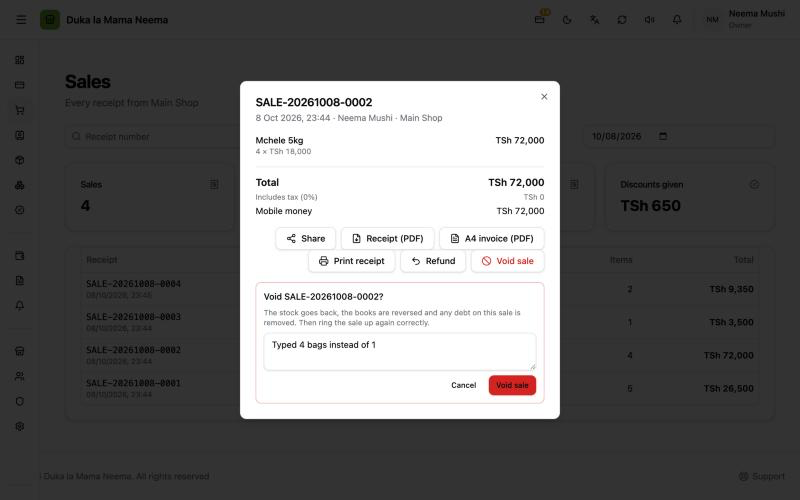
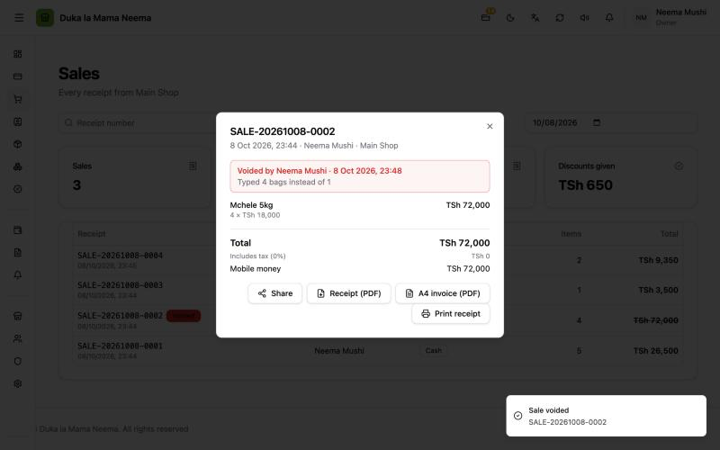

# Void a sale

**Added in v2.0.5 (7 Oct 2026).**

Voiding cancels a whole sale that was a mistake, for example 4 typed instead of 1. The stock goes back, the books are reversed, any debt from the sale is removed, and the EFD gets a credit note if it already had the receipt. Then the cashier sells it again correctly.

To give back only some items, or to return goods later, use a [refund](refunds.md) instead.

## Why it was added

Testers reported "I can't correct a sale after confirming it". Before v2.0.5 a confirmed sale could not be voided, refunded or edited at all. There is still no editing: a wrong sale is voided with a reason and sold again, so the trail stays.

## How to void a sale

1. Open **Sales History (Historia ya Mauzo)**.
2. Click the sale.
3. Press **Void sale (Batilisha mauzo)**.
4. Read the message:
   - usually: "The stock goes back, the books are reversed and any debt on this sale is removed. Then ring the sale up again correctly."
   - if the EFD already accepted the receipt: "The EFD already has this receipt, so a credit note will be sent to cancel it…"
5. Write why. For example: **typed 4 instead of 1**. At least 3 letters.
6. Press **Void sale (Batilisha mauzo)** to confirm.
7. Go to the till and sell it again correctly.

The sale now shows a red banner: **Voided by {name} · {date} (Yamebatilishwa na {name} · {date})** and the reason. In the list it has a **Voided (Yamebatilishwa)** badge.

## Who can void

The permission **Void sales (Kubatilisha mauzo)**. The owner has it. Give it to others in **Roles (Majukumu)**. Without it, the button is not shown.

## When the button does not show

| Situation | Why |
| :--- | :--- |
| The sale is already voided | A sale can be voided once. |
| The sale completed a **customer order** | Cancel or change the order instead. The order has its own deposit and stock rules. |
| The sale already has **refunds** | Refund the rest instead. Voiding would undo the refunds a second time. |
| The receipt is being sent to the EFD at that moment | The server says to try again in a moment. |
| The user lacks **Void sales** | Ask the owner. |

## What a void changes

| Area | What happens |
| :--- | :--- |
| **Stock** | Every item on the sale goes back to the shop's stock. |
| **Books** | The sale's entry is reversed in full: money, sales, VAT, and the cost of the goods. It shows on the Cash flow page as **Sale cancelled (Mauzo yaliyoghairiwa)**. If the month is already closed, the reversal goes on the first open day. |
| **Customer debt** | If part of the sale was **On credit (Mkopo)**, that debt is removed from the customer. |
| **Totals and reports** | The sale is left out of Sales History totals, the dashboard, every report and the customer's history. |
| **History** | The sale is **not deleted**. It stays in Sales History with the badge, the reason, who voided it and when. Its receipt number is not reused. |
| **EFD** | See below. |

## The EFD (fiscal receipts)

This only matters for shops with EFD switched on.

| Where the original receipt was | What the void does |
| :--- | :--- |
| **Accepted** by the EFD (**Sent to EFD**) | A **credit note** is queued to cancel it. It carries the original receipt number, the EFD verification code and the void reason. |
| **Never reached** the EFD (waiting or failed) | The waiting receipt is dropped. Nothing is sent. |
| **Being sent** right now | The void is refused. Try again in a moment. |

Credit notes are sent like waiting receipts: by the open till every 5 minutes, or with **Send waiting to EFD (Tuma zinazosubiri kwa EFD)** in Sales History. The voided sale shows **EFD credit note: {status} (Hati ya kufuta ya EFD: {status})**.

Still to confirm with a real EFD provider: that the provider accepts the credit note.

## For developers

- Endpoint: `POST /api/sales/:id/void`, body `{ "reason": "..." }` (3–200 characters), permission `sales:delete`.
- Service: `Service.Void` and `settleFiscalForVoid` in `backend/internal/sales/service.go`.
- Errors: 409 `sale_already_voided`, 409 `sale_from_order`, 409 `refund_not_possible` (has refunds), 409 `efd_busy`.
- Stock: one `stock.RecordMovement` per line, positive change, reason `sale`, reference = receipt number.
- Books: `accounting.ReverseSource` with original source `sale` and new source type `sale_void`; the reversal's `source_id` is the sale id, so the Cash flow page links it to the receipt.
- EFD: `fiscal_credit_notes` queue; payload from `BuildCreditNotePayload` (`document_type: "credit_note"`, `credit_for: "void"`, `original_receipt_number`, reason) in `backend/internal/sales/fiscal.go`.
- Leaving voided sales out: `s.voided_at IS NULL` in sales totals, reports, customer debt and the books catch-up (`accounting/replay_repository.go`).
- Migration 000057: `sales.voided_at`, `voided_by`, `void_reason`, and `fiscal_credit_notes`.
- Screen: `frontend/app/components/sales/SaleDetailsDialog.vue`.
- PRs: balceinv-api #74, balceinv #48. Details: `steps.md`, Phase 32.
