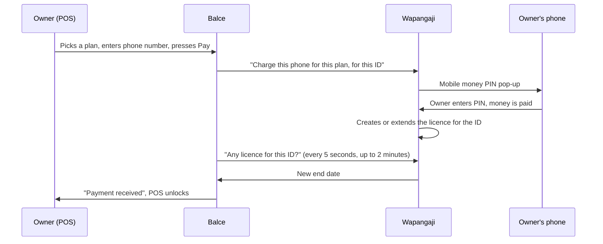

# How subscription payments work (Wapangaji)

A guide for the Balce sales and support team. No technical knowledge needed. It explains what happens behind the screen when a shop pays, so you can tell where something got stuck.

For what the customer sees (trial, grace period, lock), read [Subscriptions and activation](subscriptions.md) first.

---

## The three parts

| Part | What it is | What it keeps |
| :--- | :--- | :--- |
| **The POS** | The Balce app at the shop: the desktop app, or pos.faltasi.com | A copy of the subscription: the end date and whether it is a trial |
| **Wapangaji** | Our payment and licence server (backend.wapangaji.com) | The **plans** (name, price, days, number of devices), every shop's **licence**, and payments recorded by the sales team |
| **Mobile money** | M-Pesa, Mixx by Yas (Tigo), Airtel Money, HaloPesa, AzamPesa | The money itself |

Every shop is known to Wapangaji by **one ID**:
- **Desktop app:** the computer's **Hardware ID** (64 letters and numbers).
- **Online:** the business's **Subscription ID** (`cloud-` followed by letters and numbers).

The licence on Wapangaji is attached to that ID. That is why the ID must always be copied in full.

---

## Way 1: the owner pays inside the POS

Step by step:

1. **The owner picks a plan.** Only the owner, or an admin signed in as the owner, can do this. The plans and prices come live from Wapangaji.
2. **The owner enters the phone number and network** that will pay, and presses **Pay**.
3. **Balce asks Wapangaji to charge that phone.** It sends three things: the plan, the phone number and the shop's ID. The price is always the plan price; nobody can change it here.
4. **A PIN pop-up appears on the phone.** The owner enters the mobile money PIN.
5. **The mobile money company tells Wapangaji the money arrived.** Wapangaji then creates the licence for that ID, or extends it.
6. **The POS keeps asking Wapangaji** every 5 seconds for up to 2 minutes. As soon as the new end date appears, it shows **Payment received** and unlocks.

If two minutes pass with no answer, the POS says **Not confirmed yet**. The money may still be on its way. Tell the owner **not to pay twice**, wait a minute, and press **Check again**.

## Way 2: we record the payment with the sales tool

Use this when the shop pays us in cash, by bank transfer, or to a team member's number. How to get and use the tool: [The sales tool](sales-tool.md).

1. **The shop sends us its full ID**, copied from the account menu.
2. **We record the payment** in the sales tool: ID, plan, amount, method and reference.
3. **Wapangaji creates or extends the licence straight away** and sends the customer an SMS.
4. **The POS picks it up** the next time it checks:
   - **Locked:** within about a minute.
   - **On the free trial, or within 7 days of the end, or in the grace period:** the next time the page is opened, or Balce is opened on the desktop.
   - **On a paid plan with more than 7 days left:** nothing needs to change yet. The extra days are safe on Wapangaji and show when the plan gets close to its end.

Both ways write the **same licence** on Wapangaji. Neither is "less real" than the other.

---

## How renewals add days

A renewal **never loses days**. Wapangaji takes whichever is later, the current end date or today, and adds the plan's days to it.

| Situation | Plan bought | New end date |
| :--- | :--- | :--- |
| Plan ends 20 Oct, renewed on 10 Oct | 30 days | 20 Oct + 30 days = **19 Nov** |
| Plan ended 1 Oct, renewed on 10 Oct | 30 days | 10 Oct + 30 days = **9 Nov** |
| Still on the free trial | 30 days | Today + 30 days. The free trial days are not added on top. |

The number of devices comes from the **last plan bought**.

## Devices (desktop only)

A plan allows a number of computers (**devices**). Each time the desktop app opens with internet, it tells Wapangaji "this computer uses this licence":
- If the computer is new and there is still room, Wapangaji adds it.
- If the plan is full, the new computer is refused with **Device limit reached**. Support must remove an old computer (for example one that broke) from the licence.

Online businesses have one Subscription ID per business, so devices do not apply. Any number of computers and phones can use pos.faltasi.com.

---

## Who can change what

| Action | Who |
| :--- | :--- |
| Pay inside the POS | The shop **owner** only |
| Record a payment with the sales tool | Team members with a **partner** account on Wapangaji, and the system admin |
| Create or change **plans** (price, days, devices) | The **system admin** only, in the sales tool under **Manage Packages** |

Changing a plan's price or days only affects **new** payments. Shops that already paid keep what they paid for.

---

## Where it gets stuck, and what to do

| The customer says… | Most likely | What to do |
| :--- | :--- | :--- |
| "No PIN pop-up came" | Wrong number or network, weak signal, or the phone was busy | Press **Send again** once, with the right number and network. |
| "I entered the PIN but it still says Not confirmed" | The mobile money company has not told Wapangaji yet | Wait a minute and press **Check again**. **Do not pay again.** If it still fails after 10 minutes, send the phone number, amount and time to the technical team. |
| "You activated it but I still see Free trial" | The POS has not checked Wapangaji since | Refresh the page, or close and open Balce on the desktop. |
| "It says Device limit reached" | The plan's computers are all used | Support removes the old computer from the licence, or the shop buys a plan with more devices. |
| "The sales tool says customer not found" | The ID was cut short, or the shop has never paid | Ask for the ID again, copied with the copy button. A shop that never paid is registered as new with its phone number. |
